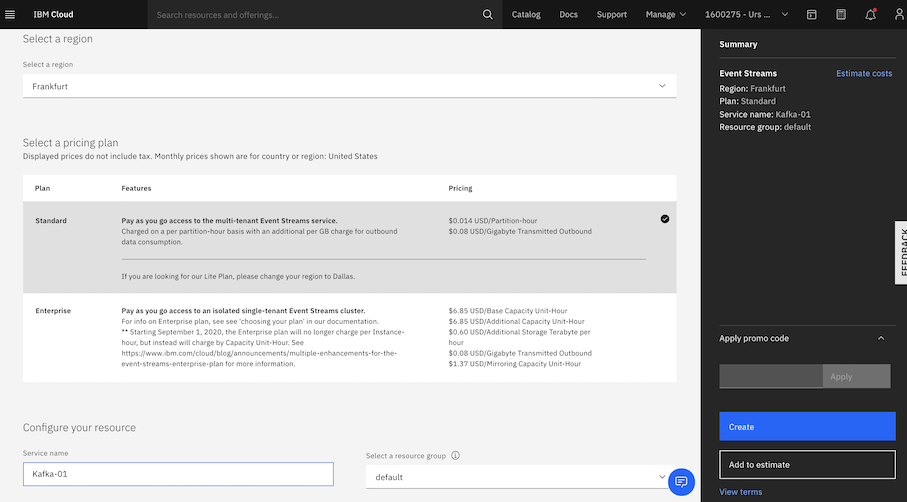
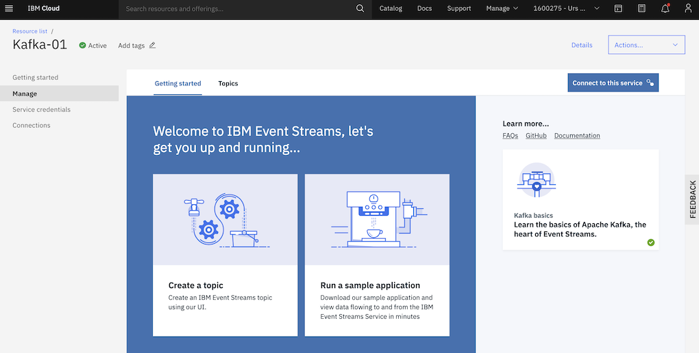

<h1 align="center" style="border-bottom: none;">:rocket: IBM Cloud Tutorial: Kafka and functions</h1>

In this hands-on tutorial you will create an IBM Event Streams Service on the IBM Cloud and run the sample application to produce events on the topic "kafka-python-console-sample-topic". Using IBM functions you create a trigger that invokes the write function every time an event arrives in the topic "kafka-python-console-sample-topic".

## Tutorial Overview


## Prerequisites

1. Sign up for an [IBM Cloud account](https://cloud.ibm.com/registration).
2. Fill in the required information and press the „Create Account“ button.
3. After you submit your registration, you will receive an e-mail from the IBM Cloud team with details about your account. In this e-mail, you will need to click the link provided to confirm your registration.
4. Now you should be able to login to your new IBM Cloud account ;-) 

## Create and configure Event Streams Service on the IBM Cloud

<h4>1) Create a Event Streams Service</h4>
After the login you will see your IBM Cloud Dashboard. In the upper right click on blue area "Create Resource". 
Type "Event Streams" in the search field of the catalog, then click on Event Streams. 
On the Event Streams page select the Standard plan, choose a region where you would like to deploy your service as well as a service name. 
Then click "Create".
<br>



<br>
<h4>2) Access your Event Streams Service</h4>
Go back to your IBM Cloud Dashboard by clicking the IBM Cloud Logo on the upper left. Under services you will find the Event Streams Service in the corresponding region. Access your service by clicking on its name.
<br>



<h4>3) Create a topic for your sample application</h4>

The next step is to create a topic where your sample application can write to. On the manage page of your Event Streams service click on "Topics", then click on "Create topic +"
<br>
Type "kafka-python-console-sample-topic" as this is the topic used by the sample event streams application and click on "Next".
<br>


On the next pages leave the values to its default and click on "Next" and finally on "Create topic". As a result your newly created topic will be displayed.
<br>


<h4>4) Add service credentials</h4>

An application can only access the service via its service credentials. Therefore we need to add service credentials as follows:

<ul>
  <li>Click on "Service credentials" on the left side on the Event Streams page.</li>
  <li>Then click on "New credential +" on the upper right side.</li>
  <li>Leave the service name to its default value and the role to "Manager" and click on "Add"</li>
</ul>


<br>
<ul>
  <li>Click **View credentials** to see the `api_key` and `kafka_brokers_sasl` values.</li>
</ul>


## Get and configure sample application to produce messages

IBM Event Streams Service is a high-throughput message bus built with Apache Kafka. To get started with Event Streams
and start sending and receiving messages, you can use the sample application. 


<h4>1) Prerequisites </h4>

**If you don't already have them, install the following prerequisites:**
	
	* [git ](https://git-scm.com/){:new_window}
	* [Gradle ](https://gradle.org/){:new_window}
	* Java 8 or higher

## Tutorial steps
{: #getting_started_steps}

1. {: #Create_topic_step notoc} **Create a topic **

   The topic is the core of {{site.data.keyword.messagehub}} flows. Data passes through a topic from producing applications to consuming applications. 

   We'll be using the {{site.data.keyword.Bluemix_notm}} console (UI) to create the topic, and will reference it when starting the application.

      a. Go to the **Topics** tab.
  
      b. Click **New topic**.
  
      c. Name your topic.
  
     The sample application is configured to connect to topic `kafka-java-console-sample-topic`. If the topic does not exist, it is created when the application is started. 
     {: important}

      d. Keep the defaults set in the rest of the topic creation, click **Next** and then **Create topic**.

      e. The topic appears in the table. You have created a topic!
  
2. {: #create_credentials_step notoc} **Create credentials**

    To allow the sample application to access your topic, we need to create some credentials for it. 

     a. Go to **Service credentials** in the navigation pane.
  
     b. Click **New credential**.
  
     c. Give the credential a name so you can identify its purpose later. You can accept the default value.
  
     d. Give the credential the **Manager** role so that it can access the topics, and create them if necessary. 
  
     e. Click **Add**. The new credential is listed in the table in **Service credentials**.
  
     f. Click **View credentials** to see the `api_key` and `kafka_brokers_sasl` values.

3. {: #clone_repository_step notoc} **Clone the Github repository for the sample application**

   The sample application is stored in Github. Clone the `event-streams-samples` repository by running the clone command from the command line. 

   ```
    git clone https://github.com/ibm-messaging/event-streams-samples.git
   ```
   {: codeblock}

   <br/>
   When the repository is cloned, from the command line change into the <code>kafka-java-console-sample</code> directory.

   ```
   cd event-streams-samples/kafka-java-console-sample
   ```
   {: codeblock}

   <br/>
   Build the contents of the <code>kafka-java-console-sample</code> directory.

   ```
   gradle clean && gradle build
   ```
   {: codeblock}

4. {: #start_consumer_step notoc} **Run the consuming application**
   
   Start the sample consuming application from the command line, replacing the `kafka_brokers_sasl` and `api_key` values. 

   The `java -jar ./build/libs/kafka-java-console-sample-2.0.jar` part of the command identifies the locations of the .JAR file to run within the cloned repository. You do not need to change this. 
   
   Use the `kafka_brokers_sasl` from the **Service credentials** created in [Step 2](/docs/EventStreams?topic=EventStreams-getting_started#create_credentials_step). We recommend using all the `kafka_brokers_sasl` listed in the **Service credentials** that you created.

   The `kafka_brokers_sasl` must be formatted as `"host:port,host2:port2"`. </br> Format the contents of `kafka_brokers_sasl` in a text editor before entering it in the command line.
   {: important}

   Then, use the `api_key` from the **Service credentials** created in [Step 2](/docs/EventStreams?topic=EventStreams-getting_started#create_credentials_step). `-consumer` specifies that the consumer should start. 

   ```
   java -jar ./build/libs/kafka-java-console-sample-2.0.jar 
   <kafka_brokers_sasl> <api_key> -consumer
   ```
   {: codeblock}

   An `INFO No messages consumed` is displayed when the consuming application is running, but there is no data being consumed. 

5. {: #start_producer_step notoc} **Run the producing application**

   Open a new command line window and change into the <code>kafka-java-console-sample</code> directory.

   ```
   cd event-streams-samples/kafka-java-console-sample
   ```
   {: codeblock}
   
   Then, start the sample producing application from the command line, replacing the `kafka_brokers_sasl` and `api_key` values. 

   The `java -jar ./build/libs/kafka-java-console-sample-2.0.jar` part of the command identifies the locations of the .JAR file to run within the cloned repository. You do not need to change this. 

   Use the `kafka_brokers_sasl` from the **Service credentials** created in [Step 2](/docs/EventStreams?topic=EventStreams-getting_started#create_credentials_step). We recommend using all the `kafka_brokers_sasl` listed in the **Service credentials** that you created.

   The `kafka_brokers_sasl` must be formatted as `"host:port,host2:port2"`. </br> Format the contents of `kafka_brokers_sasl` in a text editor before entering it in the command line.
   {: important}

   Use the `api_key` from the **Service credentials** created in [Step 2](/docs/EventStreams?topic=EventStreams-getting_started#create_credentials_step). `-producer` specifies that the producer should start. 

   ```
   java -jar ./build/libs/kafka-java-console-sample-2.0.jar
	<kafka_brokers_sasl> <api_key> -producer
   ```
   {: codeblock}

6. {: #success_step notoc} **Success!**

   When the producer starts, messages are produced to the topic. Messages are then consumed from the topic by the consuming application.
   You can verify the successful flow of messages when you see`INFO Message consumed` from the consumer. 

   The sample runs indefinitely until you stop it. To stop the process, run an exit command `Ctrl+C`.

## Next steps
{: #next_steps}

Now that you've run the Java sample application, you can try other [{{site.data.keyword.messagehub}} samples ](https://github.com/ibm-messaging/event-streams-samples){:new_window}, explore [other ways to connect ](/docs/EventStreams?topic=EventStreams-kafka_connect){:new_window} to the {{site.data.keyword.messagehub}} service, take a look at the [IBM Event Streams on IBM Cloud Private and Red Hat OpenShift ](https://www.ibm.com/cloud/garage/dte/tutorial/ibm-event-streams-tutorial-part-1) tutorial or find out more about 
[{{site.data.keyword.messagehub}} on IBM Cloud Private ](https://ibm.github.io/event-streams/){:new_window}.

To watch a video that walks
you through getting this Java sample to run, see [Getting started with IBM {{site.data.keyword.messagehub}} ](https://www.youtube.com/watch?v=XyNy7TcfJOc){:new_window}.
 
 
<!-- 07/06/18 - Karen: removing until a newer version available
To watch a video that walks
you through getting a Java sample to run against {{site.data.keyword.messagehub}}, see [{{site.data.keyword.messagehub}} - Getting started with IBM's Kafka in the cloud ](https://www.youtube.com/watch?v=tt-bLtFzC_4){:new_window}.
-->


In addition service credentials are needed so that the sample application can access the service.

build your conversation. You can choose to build a customer service assistant, an assistant for your E-commerce, a company internal assistant or any other chatbot application of your choice. The three elements to consider are Intents, Entities and the Dialog.
<ul>
  <li><strong>Intents</strong> define a user's goal or purpose. Per intent you can configure various user examples. An example of an intent could be #Price and user examples could be “How much does it cost?” and “What is the price?”</li>
<li><strong>Entities</strong> handle significant parts of an input that should be used to alter the way the assistant responds to the intent. An example of an entity could be @products with the entity values “juice” and “water”.</li>
<li><strong>Dialog</strong> consists of dialog nodes. Each node is made up of a trigger (condition) and a response. If the assistant recognizes the intent #Price, it could then respond: Would you like to know the price of juice or water? Otherwise, if the assistant recognizes the intent #Price and the entity value @products is juice, it could then respond: The price of juice is 2€ per bottle.</li>
</ul>
If you see something called "Actions" instead of Intents, Entities and Dialog, you can switch to the standard UI, by doing the following:


